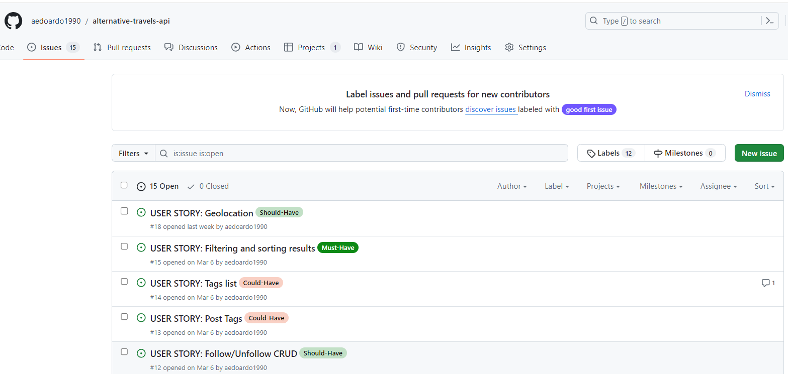
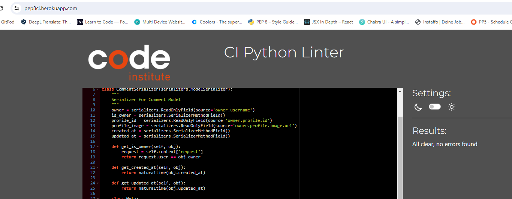

# Alternative Travels API

Welcome to Alternative Travels API set up using Django REST Framework for the Alternative Travels front-end application, a social media for sharing images, videos of alternative travels with the help of geolocation data and tags. The social media is provided as well with a marketplace section with rare products found by the users during their trips.

Here below the links to the API and the Frontend:

<strong>Backend</strong>

[Live link](https://alternative-travels-debb28d8ca03.herokuapp.com/)

<strong>Frontend</strong>

[Repository here](https://github.com/aedoardo1990/alternative-travels/)
[Live website here](https://alternative-travel-54fe13e24a2a.herokuapp.com/)


## Table of Contents
  - [User Stories](#user-stories)
  - [Data Models](#data-models)
  - [Features](#features)
  - [Agile Methodologies](#agile-methodologies)
  - [Testing](#testing)
  - [Technologies Used](#technologies-used)
  - [Deployment](#deployment)
  - [Credits](#credits)
  - [Acknowledgments](#acknowledgments)


## User Stories

The back-end section of the project focuses on the administration side and covers the user stories from the point of view of a developer and/or superuser. The User Stories are divided into the following categories:

#### Login and Registration
- As a developer I want to access an API endpoint that allows users to register by providing their username and password
- As a developer I want to have a user profile to be automatically created, when a new user signs up
- As a developer I want to access an API endpoint that allows users to log in, obtain an authentication token, and access user-specific content

#### Profiles
- As a developer I want to be able to create, read, update, and delete user profiles via the API

#### Posts with Images or Videos
- As a developer I want to be able to create, read, update, and delete posts with images about travels
- As a developer I want uploaded images to not exceed a size format limit
- As a developer I want to be able to create, update and delete post with videos about travels
- As a developer I want uploaded videos to be automatically converted to a consistent format

#### Comments
- As a developer I want to have access for creating, reading, updating, and deleting comments

#### Likes
- As a developer I want to have access for creating, reading and deleting likes

#### Marketplace
- As a developer I want to be able to create, read, update and delete posts about products to be sold on the marketplace section of the site

#### Likes and Comments of the Marketplace (apps are called Loves and Opinions)
- As a developer I want to have access for creating, reading, updating, and deleting comments and likes as well under the posts of the marketplace

#### Followers
- As a developer I want to have access for creating, reading and deleting follow relationships between users

#### Tags
- As a developer I want posts to have a tag field, so that users can tag their created posts (valid just for normal Posts and not those in the Marketplace)
- As a developer I want to display a list of tags of all the users

#### Search and Filter
- As a developer I want to have a functionality for filtering and sorting results, in order to have more control over what data to display to the user

#### Geolocation
- As a developer I want to have the possibility to add a geolocation for each post so that users can create posts with a geolocation and update it if necessary (valid just for normal Posts and not those in the Marketplace)


## Data Models

I have created the following models for the Alternative Travels API

| Models | Scope |
| :---------------------------------: | :------------------------------:|
| User | the Django standard User model |
| Profiles | to create, update, store and delete profile data |
| Posts | to create posts with images or videos, with geolocation and tag |
| Comments | to make comments about the posts |
| Likes | to like posts |
| Followers | to follow other users and be updated about their posts |
| Marketplace | to post products to sell |
| Opinions | to make comments about the posts of products on sale |
| Loves | to like posts of products on sale |


The relationships between the models is summarized in the followed entity relationship diagram.


## Features

### Homepage

When you first enter the API website, you are directed to the Root Route homepage, with a welcome message to the API of Alternative Travels.


### Profiles Data

In the Profiles section, a user can view a list of all profiles in the API.


On top of the fields created in the Profiles model (as shown in the Database Diagram), via the Serializer, the following fields are also added to the JSON data:
- is_owner
- following_id
- posts_count
- followers_count
- following_count

Create functionality is enabled to the Developer via the Django Admin Tab.


I have set up an ordering for the profiles list and selected the following parameters to sort the profiles by:
- posts_count
- followers_count
- following_count
- owner__following__created_at
- owner__followed__created_at

I have set up two field filters on the post list to filter as follows:

- owner__following__followed__profile ->  to get all profiles that are following a profile, given its id
- owner__followed__owner__profile -> to get all profiles that are followed by a profile, given its id


### Posts Data

In the Posts section, a user can view a list of all posts in the API.


Besides the fields created in the Posts model (as shown in the Database Diagram), via the Serializer, the following fields are also added to the JSON data:

- like_id
- comments_count
- likes_count
- tags_count

I have set up an ordering for the posts list and selected the following parameters to sort the posts by:

- comments_count
- likes_count
- likes__created_at

I have set up 3 field filters on the posts list to search by as follows:

- owner__username
- title
- tags__name

I have set up 3 field filters on the posts list to filter as follows:

- owner__followed__owner__profile
- likes__owner__profile
- owner__profile

CRUD functionality of the Posts is enabled to the Developer/Superuser via the Django Admin Tab.


### Comments Data

In the Comments section, a user can view a list of all the comments in the API.


On top of the fields created in the Comments model (as shown in the Database Diagram), via the Serializer, the following fields are also added to the JSON data:

- is_owner
- profile_id
- profile_image

I set up as well one field filter to filter the comments by the post they are commenting.


### Likes Data

In the Likes section, a user can view a list of all the liked posts in the API.


### Marketplace Data

In the Marketplace section, a user can view a list of all the posts of products in the API which are on sale in the Marketplace tab of the frontend.


Besides the fields created in the Marketplace model (as shown in the Database Diagram), via the Serializer, the following fields are also added to the JSON data:

- love_id
- opinions_count
- loves_count
- is_owner
- profile_id
- profile_image

I have set up an ordering for the posts list of the Marketplace and selected the following parameters to sort the posts by:

- opinions_count
- loves_count
- loves__created_at

I have set up 3 field filters on the posts list of the Marketplace to search by as follows:

- owner__username
- title
- condition
- price

CRUD functionality of the Posts of the Marketplace is enabled to the Developer/Superuser via the Django Admin Tab.


### Opinions Data

In the Opinions section, a user can view a list of all the comments related to posts on the Marketplace in the API. The name Opinions was given to differentiate this section from the comments related to the posts with geolocation and tags, but the model is the same of the Comments one. 


On top of the fields created in the Opinions model (as shown in the Database Diagram), via the Serializer, the following fields are also added to the JSON data:

- is_owner
- profile_id
- profile_image

I set up as well one field filter to filter the comments of the Marketplace by the post they are commenting.


### Loves Data

In the Loves section, a user can view a list of all the liked posts related to the Marketplace section in the API. The name Loves was given to differentiate this section from the likes related to the posts with geolocation and tags, but the model is the same of the Likes one. 


### Followers Data

In the Followers section, a user can view a list of all follower posts in the API.


The owner is the user following. In the followed_name field there is the user who is followed by the owner.


## Agile Methodologies

### Kanban Board

I used the Kanban Board to build the Alternative Travels API using Agile principles from the start. The user stories created are for a developer or superuser to follow and test throughout the build process. The Agile Principles helped to organise how to build step by step the whole application. 

Each user story has a level of prioritisation using the MoSCoW method. The 3 different levels of prioritization are divided as below:
- must-have
- should-have
- could-have





<strong>Link to the Kanban Board </strong>

[Kanban Board](https://github.com/users/aedoardo1990/projects/4)

<strong>Link to the issues page</strong>

[Issues Page](https://github.com/aedoardo1990/alternative-travels-api/issues)


## Testing

### PEP 8 Linter

<details>

<summary>Only a few errors found in the pages of the drf_api folder in settings.py file. These are related to the code provided by CI and I preferred to not touch it to avoid causing any error. For all the other apps no errors were found</summary>

#### DRF_API
- permissions.py


- serializers.py 


- settings.py


- views.py


- urls.py


#### COMMENTS
- apps.py


- serializers.py 


- models.py


- views.py


- urls.py


#### FOLLOWERS
- apps.py


- serializers.py 


- models.py


- views.py


- urls.py


#### LIKES
- apps.py


- serializers.py 


- models.py


- views.py


- urls.py


#### LOVES
- apps.py


- serializers.py 


- models.py


- views.py


- urls.py


#### MARKETPLACE
- admin.py


- apps.py


- serializers.py 


- models.py


- views.py


- urls.py


#### OPINIONS
- apps.py


- serializers.py 


- models.py


- views.py


- urls.py


#### POSTS
- admin.py


- apps.py


- serializers.py 


- models.py


- tests.py


- views.py


- urls.py


#### PROFILES

- apps.py


- serializers.py 


- models.py


- views.py


- urls.py


</details>


### User Story Testing

| Expectation (As a developer/superuser, I want to...)  | Result (As a developer/superuser, I...)    |
| :---------------------------------: | :------------------------------:|
| access an API endpoint that allows users to register by providing their username and password. | can register new users with username and password. |
| have a user profile to be automatically created, when a new user signs up. | have a user profile automatically created if I ll sign up as a new user. |
| access an API endpoint that allows users to log in, obtain an authentication token, and access user-specific content. | have an API which allow users to access and modify user specific content only when logged in. |
| be able to create, read, update, and delete user profiles via the API. | have full CRUD functionality for user profiles in the API via the Admin Tab. |
| create, read, update, and delete posts with images about travels. | have full CRUD functionality via the Admin Tab. |
| uploaded images to not exceed a size format limit. | have a validator which does not allow to upload images exceeding 2MB. |
| be able to create, update and delete post with videos about travels. | have a validator which does not allow to upload videos exceeding 60MB. |
| uploaded videos to be automatically converted to a consistent format | have videos with a fitting format when they are uploaded if they do not exceed 60 MB. |
| have access for creating, reading, updating, and deleting comments. | have full CRUD functionality for the Comments via the Admin Tab. |
| have access for creating, reading and deleting likes. | have full CRUD for the Likes via the Admin Tab. |
| be able to create, read, update and delete posts about products to be sold on the marketplace section of the site. | have full CRUD for the posts of the Marketplace via the Admin Tab. |
| have access for creating, reading, updating, and deleting comments and likes as well under the posts of the marketplace. | have full CRUD for the comments and likes related to the Marketplace model. |
| have access for creating, reading and deleting follow relationships between users. | have full CRUD to manage follow relationships between users via the Admin Tab. |
| have posts with a tag field, so that users can tag their created posts. | have Posts with a tag field to enter multiple tags. |
| display a list of tags of all the users. | can access a full list of tags of the users via the Admin tab. |
| have a functionality for filtering and sorting results, in order to have more control over what data to display to the user. | can filter and sort but just in the User Section of the Admin Tab. This filter function should be implemented as well for all the other models.  |
| have the possibility to add a geolocation for each post so that users can create posts with a geolocation and update it if necessary. | have a latitude and a longitude fields in the Post model so that users can create posts with their geolocation. |


## Bugs

### Unfixed Bugs

#### Not able to login into account in REST Framework format

Since I changed the code of the API for deploying the site, if I change DEBUG to True and remove JSON format option from settings.py, when I try to log in, I am not redirected to the user page. The page will look as in the image below. 


However, via the Admin Tab I have full CRUD as Superuser/Developer. Admin tab is accessible at https://8000-aedoardo199-alternative-anz3oyksrix.ws-eu110.gitpod.io/admin/


## Technologies Used

### Languages

* [Python](https://en.wikipedia.org/wiki/Python_(programming_language)) - Provides the functionality for the DRF backend framework.


### Frameworks and Software

* [Django Rest Framework](https://www.django-rest-framework.org/) - Framework for building web API's.
* [PEP8 Linter](https://pep8ci.herokuapp.com/) - Tool provided by Code Institute to check the Python code against some of the style conventions in PEP 8.
* [Github](https://github.com/) - Used to host the repository, store the commit history and manage the Kanban board containing the user stories.
* [Heroku](https://en.wikipedia.org/wiki/Heroku) - Cloud platform used to deploy the application
* [Cloudinary](https://cloudinary.com/) - Platform hosting image and video files for the project.
* [Gitpod](https://gitpod.io/workspaces) - Cloud development environment.


### Libraries

The libraries used in this project are located in the requirements.txt. Here below a list of all the libraries. 

- [asgiref](https://pypi.org/project/asgiref/) - ASGI is a standard for Python asynchronous web apps and servers to communicate with each other, and positioned as an asynchronous successor to WSGI.
- [cloudinary](https://pypi.org/project/cloudinary/) - The Cloudinary Python SDK allows to easily integrate your application with Cloudinary.
- [dj-database-url](https://pypi.org/project/dj-database-url/0.5.0/) - to utilize the inspired DATABASE_URL environment variable to configure the Django application.
- [dj-rest-auth](https://pypi.org/project/dj-rest-auth/) - For handling authentication securely in Django Rest Framework.
- [Django](https://pypi.org/project/Django/) - high-level Python web framework.
- [django-allauth](https://pypi.org/project/django-allauth/) - Set of Django applications addressing authentication, registration, account management and third party (social) account authentication.
- [django-cloudinary-storage](https://pypi.org/project/django-cloudinary-storage/) - Django package that facilitates integration with Cloudinary by implementing Django Storage API.
- [django-cors-headers](https://pypi.org/project/django-cors-headers/) - A Django App that adds Cross-Origin Resource Sharing (CORS) headers to responses. This allows in-browser requests to your Django application from other origins.
- [django-filter](https://pypi.org/project/django-filter/) - Django application allowing users to declaratively add dynamic QuerySet filtering from URL parameters.
- [django-rest-framework](https://pypi.org/project/djangorestframework/) - web-browsable Web APIs.
- [djangorestframework-simplejwt](https://pypi.org/project/djangorestframework-simplejwt/) - JSON Web Token authentication plugin for the Django REST Framework.
- [gunicorn](https://pypi.org/project/gunicorn/) - Gunicorn ‘Green Unicorn’ is a Python WSGI HTTP Server for UNIX. It’s a pre-fork worker model ported from Ruby’s Unicorn project. The Gunicorn server is broadly compatible with various web frameworks, simply implemented, light on server resource usage, and fairly speedy.
- [oauthlib](https://pypi.org/project/oauthlib/) - Framework which implements the logic of OAuth1 or OAuth2 without assuming a specific HTTP request object or web framework.
- [pillow](https://pypi.org/project/Pillow/8.2.0/) - To add image processing capabilities to the Python interpreter.
- [psycopg2](https://pypi.org/project/psycopg2/) - PostgreSQL database adapter for the Python programming language.
- [PyJWT](https://pypi.org/project/PyJWT/) - Python implementation of RFC 7519.
- [python3-openid](https://pypi.org/project/python3-openid/) - OpenID support for modern servers and consumers.
- [pytz](https://pypi.org/project/pytz/) - Set of Python packages to support use of the OpenID decentralized identity system in your application, update to Python 3
- [requests-oauhlib](https://pypi.org/project/requests-oauthlib/) - P    rovides first-class OAuth library support for Requests.
- [sqlparse](https://pypi.org/project/sqlparse/) - Non-validating SQL parser for Python. It provides support for parsing, splitting and formatting SQL statements.
- [django-tagulous](https://django-tagulous.readthedocs.io/en/latest/) - Tagging library for Django.


## Deployment

The project was deployed to [Heroku](https://www.heroku.com). To deploy, please follow the process below:

1. To begin with we need to create a GitHub repository from the [Code Institute template](https://github.com/Code-Institute-Org/gitpod-full-template) by following the link and then click 'Use this template'.

2. Fill in the details for the new repository and then click 'Create Repository From Template'.

3. When the repository has been created, click on the 'Gitpod' button to open it in the GitPod Editor.

4. Now it's time to install Django and the supporting libraries that are needed, using the following commands:

* ```pip3 install 'django<4' gunicorn```
* ```pip3 install 'dj_database_url psycopg2```
* ```pip3 install 'dj3-cloudinary-storage```

5. When Django and the libraries are installed we need to create a requirements file.

* ```pip3 freeze --local > requirements.txt``` - This will create and add required libraries to requirements.txt


6. Now it's time to create the project.

* ```django-admin startproject YOUR_PROJECT_NAME .``` - This will create the new project.

7. When the project is created we can now create the applications. My project consists of the following apps: Posts, Comments, Likes, Profiles, Followers, Marketplace, Opinions, Loves.

* ```python3 manage.py startapp APP_NAME``` - This will create an application

8. We now need to add the applications to settings.py in the INSTALLED_APPS list.

8. Now it is time to do our first migration and run the server to test that everything works as expected. This is done by writing the commands below.

* ```python3 manage.py makemigrations``` - This will prepare the migrations
* ```python3 manage.py migrate``` - This will migrate the changes
* ```python3 manage.py runserver``` - This runs the server. To test it, click the open browser button that will be visible after the command is run.

9. Now it is time to create our application on Heroku, attach a database, prepare our environment and settings.py file and setup the Cloudinary storage for our static and media files.

* Once signed into your [Heroku](https://www.heroku.com/) account, click on the button labeled 'New' to create a new app. 

10. Choose a unique app name, choose your region and click 'Create app".


11. Next we need to connect an external PostgreSQL database to the app from [ElephantSQL](https://customer.elephantsql.com/login).  Once logged into your ElephantSQL dashboard, you click 'Create New Instance' to create a new database. Give the database a: 
* Name
* Tiny Turtle Free Plan
* Selected data center near you

and click 'Create Instance'. Return to your ElephantSQL Dashboard, and click into your new database instance. Copy the Database URL and head back to Heroku.

12. Back in your Heroku app settings, click on the 'Reveal Config Vars' button. Create a config variable called DATABASE_URL and paste in the URL you copied from ElephantSQL. This connects the database into the app. 

13. Go back to GitPod and create a new env.py in the top level directory. Then add these rows.

* ```import os``` - This imports the os library
* ```os.environ["DATABASE_URL"]``` - This sets the environment variables.
* ```os.environ["SECRET_KEY"]``` - Here you can choose whatever secret key you want.

14. Back in the Heroku Config Vars settings, create another variable called SECRET_KEY and copy in the same secret key as you added into the env.py file. Don't forget to add this env.py file into the .gitignore file so that it isn't commited to GitHub for other users to find. 

15. Now we have to connect to our environment and settings.py file. In the settings.py, add the following code:

```import os```

```import dj_database_url```

```if os.path.isfile("env.py"):```

```import env```

16. In the settings file, remove the insecure secret key and replace it with:
```SECRET_KEY = os.environ.get('SECRET_KEY')```

17. Now we need to comment out the old database settings in the settings.py file (this is because we are going to use the postgres database instead of the sqlite3 database).

Instead, we add the link to the DATABASE_URL that we added to the environment file earlier.

18. Save all your fields and migrate the changes again.

```python3 manage.py migrate```

19. Now we can set up [Cloudinary](https://cloudinary.com/users/login?RelayState=%2Fconsole%2Fmedia_library%2Ffolders%2Fhome%3Fconsole_customer_external_id%3Dc-95a4cb26371c4a6bc47e19b0f130a1#gsc.tab=0) (where we will store our static files). First you need to create a Cloudinary account and from the Cloudinary dashboard copy the API Environment Variable.

20. Go back to the env.py file in Gitpod and add the Cloudinary url (it's very important that the url is correct):

```os.environ["CLOUDINARY_URL"] = "cloudinary://************************"```

21. Let's head back to Heroku and add the Cloudinary url in Config Vars. We also need to add a disable collectstatic variable to get our first deployment to Heroku to work.

22. Back in the settings.py file, we now need to add our Cloudinary Libraries we installed earlier to the INSTALLED_APPS list. Here it is important to get the order correct.

* cloudinary_storage
* django.contrib.staticfiles
* cloudinary

23. For Django to be able to understand how to use and where to store static files we need to add some extra rows to the settings.py file.

24. Now we just need to create the basic file directory in Gitpod.

* Create a file called **Procfile* and add the line ```web: gunicorn PROJ_NAME.wsgi?``` to it.

25. Now you can save all the files and prepare for the first commit and push to Github by writing the lines below.

* ```git add .```
* ```git commit -m "Deployment Commit```
* ```git push```

26. Now it's time for deployment. Scroll to the top of the settings page in Heroku and click the 'Deploy' tab. For deployment method, select 'Github'. Search for the repository name you want to deploy and then click connect.

27. Scroll down to the manual deployment section and click 'Deploy Branch'.


## Credits

- [CI Walkthrough Project](https://github.com/Code-Institute-Solutions/drf-api/tree/eb665d43f0a5ade22fe3ab949f7ecb02d457d12a) - for setting up the main structure of the code of my application
- [Sonic Explorers API](https://github.com/nacht-falter/sonic-explorers-api/) - for setting up the geolocation and tags functionalities
- [Skateverse API](https://github.com/vanderpatrick/skt-drf-api) - to learn how to include the videos in the Post model
- [Events API](https://github.com/quiltingcode/events-backend-api/tree/main) - as an example for this readme


## Acknowledgments 

My mentor Antonio for pointing me always in the right direction. 30 minutes with him are worth 30 professional lessons.


