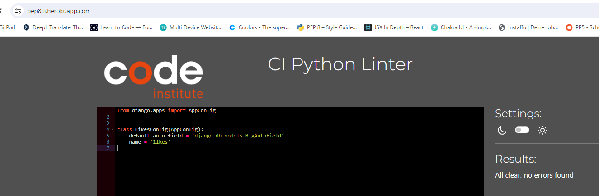

# Alternative Travels API

Welcome to Alternative Travels API set up using Django REST Framework for the Alternative Travels front-end application, a social media for sharing images, videos of alternative travels with the help of geolocation data and tags. The social media is provided as well with a marketplace section with rare products found by the users during their trips.

Here below the links to the API and the Frontend:

<strong>Backend</strong>

[Live link](https://alternative-travels-debb28d8ca03.herokuapp.com/)

<strong>Frontend</strong>

[Repository here](https://github.com/aedoardo1990/alternative-travels/)
[Live website here](https://alternative-travel-54fe13e24a2a.herokuapp.com/)

## Table of Contents
  - [User Stories](#user-stories)
  - [Data Models](#data-models)
  - [Features](#features)
  - [Agile Methodologies](#agile-methodologies)

## User Stories

The back-end section of the project focuses on the administration side and covers the user stories from the point of view of a developer and/or superuser. The User Stories are divided into the following categories:

#### Login and Registration
- As a developer I want to access an API endpoint that allows users to register by providing their username and password
- As a developer I want to have a user profile to be automatically created, when a new user signs up
- As a developer I want to access an API endpoint that allows users to log in, obtain an authentication token, and access user-specific content

#### Profiles
- As a developer I want to be able to create, read, update, and delete user profiles via the API

#### Posts with Images or Videos
- As a developer I want to be able to create, read, update, and delete posts with images about travels
- As a developer I want uploaded images to not exceed a size format limit
- As a developer I want to be able to create, update and delete post with videos about travels
- As a developer I want uploaded videos to be automatically converted to a consistent format

#### Comments
- As a developer I want to have access for creating, reading, updating, and deleting comments

#### Likes
- As a developer I want to have access for creating, reading and deleting likes

#### Marketplace
- As a developer I want to be able to create, read, update and delete posts about products to be sold on the marketplace section of the site

#### Likes and Comments of the Marketplace (apps are called Loves and Opinions)
- As a developer I want to have access for creating, reading, updating, and deleting comments and likes as well under the posts of the marketplace

#### Followers
- As a developer I want to have access for creating, reading and deleting follow relationships between users

#### Tags
- As a developer I want posts to have a tag field, so that users can tag their created posts (valid just for normal Posts and not those in the Marketplace)
- As a developer I want to display a list of tags of all the users

#### Search and Filter
- As a developer I want to have a functionality for filtering and sorting results, in order to have more control over what data to display to the user

#### Geolocation
- As a developer I want to have the possibility to add a geolocation for each post so that users can create posts with a geolocation and update it if necessary (valid just for normal Posts and not those in the Marketplace)

## Data Models

I have created the following models for the Alternative Travels API

| Models | Scope |
| :---------------------------------: | :------------------------------:|
| User | the Django standard User model |
| Profiles | to create, update, store and delete profile data |
| Posts | to create posts with images or videos, with geolocation and tag |
| Comments | to make comments about the posts |
| Likes | to like posts |
| Followers | to follow other users and be updated about their posts |
| Marketplace | to post products to sell |
| Opinions | to make comments about the posts of products on sale |
| Loves | to like posts of products on sale |

The relationships between the models is summarized in the followed entity relationship diagram.

## Features

### Homepage

When you first enter the API website, you are directed to the Root Route homepage, with a welcome message to the API of Alternative Travels.

### Profiles Data

In the Profiles section, a user can view a list of all profiles in the API.

On top of the fields created in the Profiles model (as shown in the Database Diagram), via the Serializer, the following fields are also added to the JSON data:
- is_owner
- following_id
- posts_count
- followers_count
- following_count

Create functionality is enabled to the Developer via the Django Admin Tab.

I have set up an ordering for the profiles list and selected the following parameters to sort the profiles by:
- posts_count
- followers_count
- following_count
- owner__following__created_at
- owner__followed__created_at

I have set up two field filters on the post list to filter as follows:

- owner__following__followed__profile ->  to get all profiles that are following a profile, given its id
- owner__followed__owner__profile -> to get all profiles that are followed by a profile, given its id

### Posts Data

In the Posts section, a user can view a list of all posts in the API.

Besides the fields created in the Posts model (as shown in the Database Diagram), via the Serializer, the following fields are also added to the JSON data:

- like_id
- comments_count
- likes_count
- tags_count

I have set up an ordering for the posts list and selected the following parameters to sort the posts by:

- comments_count
- likes_count
- likes__created_at

I have set up 3 field filters on the posts list to search by as follows:

- owner__username
- title
- tags__name

I have set up 3 field filters on the posts list to filter as follows:

- owner__followed__owner__profile
- likes__owner__profile
- owner__profile

CRUD functionality of the Posts is enabled to the Developer/Superuser via the Django Admin Tab.

### Comments Data

In the Comments section, a user can view a list of all the comments in the API.

On top of the fields created in the Comments model (as shown in the Database Diagram), via the Serializer, the following fields are also added to the JSON data:

- is_owner
- profile_id
- profile_image

I set up as well one field filter to filter the comments by the post they are commenting.

### Likes Data

In the Likes section, a user can view a list of all the liked posts in the API.

### Marketplace Data

In the Marketplace section, a user can view a list of all the posts of products in the API which are on sale in the Marketplace tab of the frontend.

Besides the fields created in the Marketplace model (as shown in the Database Diagram), via the Serializer, the following fields are also added to the JSON data:

- love_id
- opinions_count
- loves_count
- is_owner
- profile_id
- profile_image

I have set up an ordering for the posts list of the Marketplace and selected the following parameters to sort the posts by:

- opinions_count
- loves_count
- loves__created_at

I have set up 3 field filters on the posts list of the Marketplace to search by as follows:

- owner__username
- title
- condition
- price

CRUD functionality of the Posts of the Marketplace is enabled to the Developer/Superuser via the Django Admin Tab.

### Opinions Data

In the Opinions section, a user can view a list of all the comments related to posts on the Marketplace in the API. The name Opinions was given to differentiate this section from the comments related to the posts with geolocation and tags, but the model is the same of the Comments one. 

On top of the fields created in the Opinions model (as shown in the Database Diagram), via the Serializer, the following fields are also added to the JSON data:

- is_owner
- profile_id
- profile_image

I set up as well one field filter to filter the comments of the Marketplace by the post they are commenting.

### Loves Data

In the Loves section, a user can view a list of all the liked posts related to the Marketplace section in the API. The name Loves was given to differentiate this section from the likes related to the posts with geolocation and tags, but the model is the same of the Likes one. 

### Followers Data

In the Followers section, a user can view a list of all follower posts in the API.

The owner is the user following. In the followed_name field there is the user who is followed by the owner.

## Agile Methodologies

### Kanban Board

I used the Kanban Board to build the Alternative Travels API using Agile principles from the start. The user stories created are for a developer or superuser to follow and test throughout the build process. The Agile Principles helped to organise how to build step by step the whole application. 

Each user story has a level of prioritisation using the MoSCoW method. The 3 different levels of prioritization are divided as below:
- must-have
- should-have
- could-have

<strong>Link to the Kanban Board </strong>

[Kanban Board](https://github.com/users/aedoardo1990/projects/4)

<strong>Link to the issues page</strong>

[Issues Page](https://github.com/aedoardo1990/alternative-travels-api/issues)

## Testing

### PEP 8 Linter

Only a few errors found in the pages of the drf_api folder in settings.py file. These are related to the code provided by CI and I preferred to not touch it to avoid causing any error. For all the other apps no errors were found

#### DRF_API
- permissions.py

- serializers.py 

- settings.py

- views.py

- urls.py

#### COMMENTS
- apps.py

- serializers.py 

- models.py

- views.py

- urls.py

#### FOLLOWERS
- apps.py

- serializers.py 

- models.py

- views.py

- urls.py

#### LIKES
- apps.py

- serializers.py 

- models.py

- views.py

- urls.py

#### LOVES
- apps.py

- serializers.py 

- models.py

- views.py

- urls.py

#### MARKETPLACE
- admin.py

- apps.py

- serializers.py 

- models.py

- views.py

- urls.py

#### OPINIONS
- apps.py

- serializers.py 

- models.py

- views.py

- urls.py

#### POSTS
- admin.py

- apps.py

- serializers.py 

- models.py

- tests.py

- views.py

- urls.py

#### PROFILES

- apps.py

- serializers.py 

- models.py

- views.py

- urls.py

### User Story Testing

| Expectation (As a developer/superuser, I want to...)  | Result (As a developer/superuser, I...)    |
| :---------------------------------: | :------------------------------:|
| access an API endpoint that allows users to register by providing their username and password. | can register new users with username and password. |
| have a user profile to be automatically created, when a new user signs up. | have a user profile automatically created if I ll sign up as a new user. |
| access an API endpoint that allows users to log in, obtain an authentication token, and access user-specific content. | have an API which allow user to access and modify user specific content only when logged in. |
| be able to create, read, update, and delete user profiles via the API. | have full CRUD functionality for user profiles in the API via the Admin Tab. |
| create, read, update, and delete posts with images about travels. | have full CRUD functionality via the Admin Tab. |
| uploaded images to not exceed a size format limit. | have a validator which does not allow to upload images exceeding 2MB. |
| be able to create, update and delete post with videos about travels. | have a validator which does not allow to upload videos exceeding 60MB. |
| uploaded videos to be automatically converted to a consistent format | have videos with a fitting format when they are uploaded if they do not exceed 60 MB. |
| have access for creating, reading, updating, and deleting comments. | have full CRUD functionality for the Comments via the Admin Tab. |
| have access for creating, reading and deleting likes. | have full CRUD for the Likes via the Admin Tab. |
| be able to create, read, update and delete posts about products to be sold on the marketplace section of the site. | have full CRUD for the posts of the Marketplace via the Admin Tab. |
| have access for creating, reading, updating, and deleting comments and likes as well under the posts of the marketplace. | have full CRUD for the comments and likes related to the Marketplace model. |
| have access for creating, reading and deleting follow relationships between users. | have |
| posts to have a tag field, so that users can tag their created posts. | |
| display a list of tags of all the users. | |
| have a functionality for filtering and sorting results, in order to have more control over what data to display to the user. | |
| have the possibility to add a geolocation for each post so that users can create posts with a geolocation and update it if necessary. | |

## Bugs

